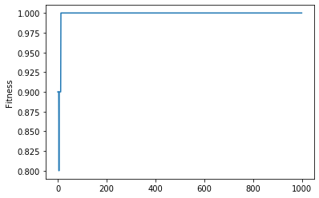
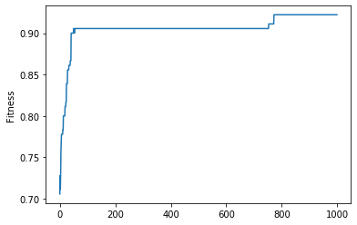
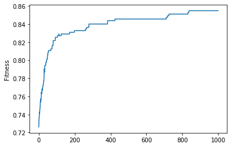
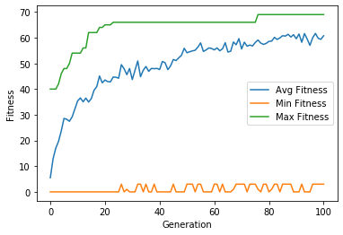

# Sudoko-SFT-GA
Implementation of a Sudoku puzzle solver (Task 1) with a GA and a Santa Fe Ant Trail problem with a GP (Task 2).

### Task 1
To run the code for the Sudoku GA, use the command below:
```bash
python task1_sudoku.py
```
You will need to have Python 3.6+ installed, Numpy, and Matplotlib. If you have Anaconda 6+ installed, it should also work fine. The file contains three different puzzle (2x2, 3x3 and 4x4). To switch which puzzle is solved, change the puzzle passed to the `puzzleProblem` variable on line 53. Parameters for the GA like initial population size, start on line 70.

The results for the 2x2 run for 1000 generations is below.


The results for the 3x3 run for 1000 generations is below.


The results for the 4x4 run or 1000 generations is below.


### Task 2
The code for the GP implementation for the Santa Fe Ant Trail problem, is built using code from [DEAP](https://deap.readthedocs.io/en/master/examples/gp_ant.html), the EA library for Python, and their tutorial on GPs for this problems. Their documentation page [here](https://github.com/DEAP/deap) also describes how to install it. To run this, use the command below:
```bash
python task2_santaFeTrail.py
```
You will need to have the same libraries installed as above, along with DEAP 1.3+. 

The results for max/min/avg fitness over 100 generations is shown below.


